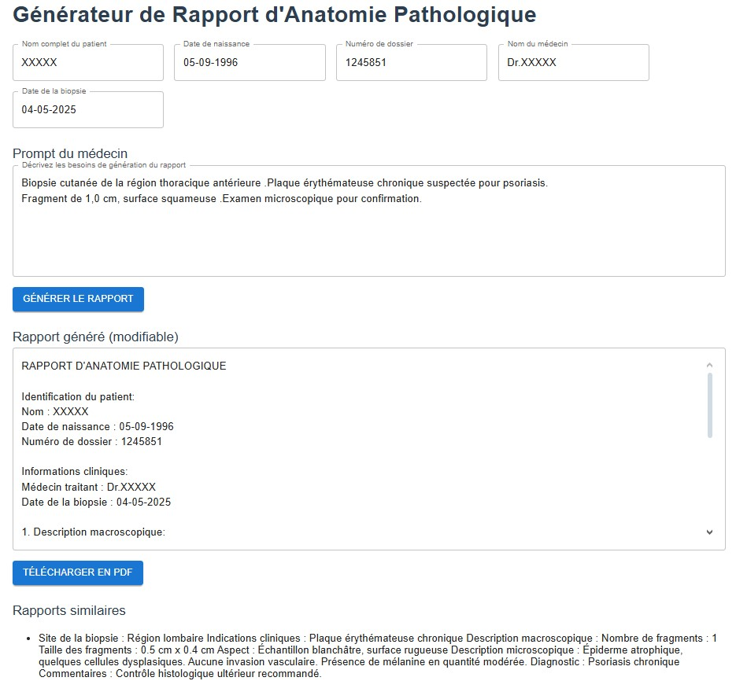

#  AI-Powered Assistant for Automated Biopsy Report Generation

## Project Overview

This repository contains the implementation of my **2nd-year engineering end-of-year project (PFA)** carried out at **ITProgress, Tunis, Tunisia** from **March 15, 2025, to May 30, 2025**. The project focuses on building an **AI-powered assistant for biopsy report generation** using **RAG (Retrieval-Augmented Generation)**, semantic search with **PostgreSQL + pgvector**, and local LLMs with **Ollama**. The solution aims to **reduce doctors’ workload, save time, and improve the consistency of medical reports**.

⚠️ **Confidentiality Notice:** The data used in this project comes from a **partner laboratory** and is strictly **private and confidential**.

---

## Features

* **Vector Database (PostgreSQL + pgvector):** Efficient semantic search over past biopsy reports.
* **Local Embeddings:** Generated using `all-MiniLM-L6-v2` (384 dimensions).
* **RAG Pipeline:** Combines semantic retrieval and LLM-powered report generation.
* **Evaluation Metrics:**

  * **ROUGE Score:** 82.5%
  * **BLEU Score:** 76.3%
  * **Cosine Similarity:** 0.91
  * **Time Reduction:** Doctors’ report-writing time reduced by **\~50%**.
* **FastAPI Backend** for API endpoints.
* **React.js + Tailwind Frontend** for an interactive user interface.
* **Interface Capabilities:**

  * Displays **most similar reports** retrieved from the database.
  * Generates a **new report** that the doctor can review.
  * Allows doctors to **download the final report as a PDF**.

---

## Tech Stack

* **Backend:** FastAPI, PostgreSQL (pgvector), Ollama
* **Frontend:** React.js, Tailwind CSS
* **Embeddings:** all-MiniLM-L6-v2 (SentenceTransformers)
* **Evaluation:** ROUGE, BLEU, Cosine Similarity

---

## Added Value

This project demonstrates how **AI and semantic search can transform pathology workflows**. By automating repetitive writing tasks while ensuring **accuracy and reviewability**, the system:

* **Improves productivity** of pathologists.
* **Reduces errors** in medical documentation.
* **Saves \~50% of the time** usually spent on writing reports.

---

## Conclusion

This PFA project not only provided a strong technical learning experience but also demonstrated **real-world medical impact**. It highlights how **AI-driven assistants can support healthcare professionals** by combining semantic retrieval and natural language generation into a practical tool.

